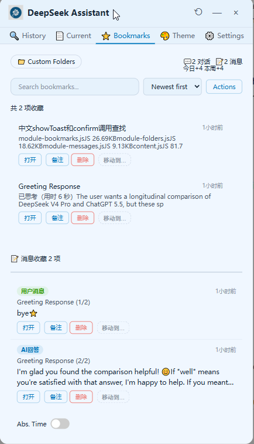

# DeepSeek 助手

[](https://developer.chrome.com/docs/extensions/mv3/intro/)
[](./LICENSE)


**让你的 DeepSeek 更好用** — 对话搜索、收藏管理、主题切换、中英文国际化……  
所有数据均存储在本地浏览器中，无追踪、无后端。

📖 **选择你喜欢的语言查看完整文档：**  
[**中文完整文档**](./README-ZN.md) | [**English Full Docs**](./README-EN.md)

---

## ✨ 核心功能

### 🔍 三模式搜索
- **历史对话搜索** — API 全量分页获取，秒加载全部对话，显示精确时间戳（今天/昨天/3天前/日期+周几），失败自动降级为侧边栏滚动
- **对话消息搜索** — API 全量获取当前对话消息，支持关键词实时搜索、格式块类型过滤（代码块/表格/数学公式/Mermaid）、角色过滤（AI回答/用户提问）、轮次排序
- **格式块跳转导航** — Ctrl+↑/↓ 快捷键在代码块、表格、标题等格式块之间快速跳转，悬浮菜单可选择优先跳转类型

### ⭐ 批量操作（全新）
- **全选/多选** — 收藏夹、历史搜索、对话消息标签页均支持复选框多选，Shift 连续选择，按"全部/仅对话/仅消息"分类全选
- **批量处理** — 批量删除、批量移动、批量导出、批量收藏、批量备注（覆盖/追加两种模式）
- **操作栏智能显隐** — 选中任意项后底部浮现操作栏，按钮文字精简适配小面板

### 📌 格式块独立收藏（全新）
- **四角星 ✴ 按钮** — 页面中的代码块、表格、数学公式、Mermaid 图表旁自动注入金色四角星按钮，点击即可独立收藏单个格式块
- **五角星 ⭐ 收藏增强** — 收藏整轮 AI 回答时优先通过 API 获取完整原始 Markdown，导出时完美还原表格/代码块/公式
- **导出到 Obsidian** — 导出文件自动清洗 BOM 头、统一换行符、移除零宽字符，拖拽到 Obsidian 可直接触发原生渲染

### 👁️ 消息预览浮层（全新）
- **悬停预览** — 对话搜索和收藏夹标签页均支持鼠标悬停 0.4 秒弹出预览浮层
- **代码语法高亮** — 引入 highlight.js，Python/JavaScript/Mermaid 等语言完整高亮
- **数学公式渲染** — 引入 KaTeX，块级和行内公式可视化渲染
- **智能位置自适应** — 下方优先，空间不足自动翻转，右侧溢出左偏移
- **滑动开关** — 独立控制两个标签页，状态持久化

### 📂 收藏夹（对话 & 消息）
- **多种收藏方式** — 悬浮按钮 / 快捷键 `Ctrl+Shift+X` / 右键菜单
- **文件夹管理** — 自定义文件夹，支持搜索、重命名、删除，通过下拉菜单快速筛选
- **统计信息** — 对话、消息收藏数量实时显示，今日/本周新增
- **时间显示** — 相对时间与绝对时间切换
- **导入导出** — JSON/TXT/Markdown 格式备份；收藏还可导出为 HTML、浏览器打印 PDF 与 Word / DOCX，更好保留代码块、数学公式与 Mermaid 图表
- **对话框片折叠** — 折叠/展开切换，状态持久化

### 🌐 国际化
- **全界面中英文切换** — 覆盖所有标签页、弹窗、提示文字，**240+ 翻译键**
- **智能语言检测** — 自动识别浏览器语言并应用，切换即时生效无需刷新
- **Content Script 国际化** — 页面端按钮、弹窗、提示全部支持中英文切换

### 🎨 外观与操作
- **6套预设主题** + 自定义取色器 + 跟随系统模式
- **🎁 彩蛋主题** — 隐藏款「深海极客」主题，Canvas 粒子特效 + 跑马灯光条 + 金色边框
- **面板拖拽缩放** — 右/下/右下角拖拽调整尺寸（340~900px 宽 / 400~1200px 高），尺寸记忆持久化
- **面板拖拽移动** — 标题栏长按拖拽，按对话 URL 记忆位置
- **悬浮按钮** — 右下角 ⭐ 收藏按钮，长按弹出快捷菜单（打开面板、复制链接、切换尺寸、格式块跳转）
- **快捷键** — `Alt+K` 呼出面板，`Ctrl+Shift+X` 收藏对话，`Ctrl+↑/↓` 格式块跳转

### 🧩 其他贴心功能
- **Canvas 弹窗系统** — 深海极客视觉风格，版本更新弹窗优先显示，格式块提示弹窗在关闭后才弹出
- **存储用量监控** — 实时显示已用空间，超过 80% 警告
- **设置页** — 结构化设置中心，包含反馈入口和专属奖励兑换
- **匿名使用统计** — 仅收集功能使用频率，用于产品改进

---

## 📥 安装方式

| 浏览器 | 商店链接 |
|:---|:---|
| Microsoft Edge | [](https://microsoftedge.microsoft.com/addons/detail/ofepipaoojckjihdofklifgdobndcfmk) |
| Google Chrome | [](https://chromewebstore.google.com/detail/mpgaedmobnhoaceeefcafjofclenjbah) |


---

## 📚 文档导航

- [**中文完整文档**](./README-ZN.md) – 详细功能介绍、安装指南、更新日志
- [**English Full Docs**](./README-EN.md) – Complete feature guide, installation, and changelog
- [已知问题与限制](./KNOWN_ISSUES.md) – 当前版本的限制与临时解决方案
- [常见问题 FAQ](./FAQ.md) – 使用中常见的问题解答
- [贡献指南](./CONTRIBUTING.md) – 如何报告 Bug 或提交代码

---

## 📸 截图预览



---

## 📝 更新日志

完整版本历史请查阅 [CHANGELOG.md](./CHANGELOG.md)。  
最新 v2.0.0 — **核心架构重构**带来的稳定性提升、搜索与收藏体验优化，以及 HTML / PDF / DOCX 富内容导出。

---

## 🧑‍💻 参与贡献

欢迎提交 Issue、功能建议或 Pull Request！  
请先阅读 [CONTRIBUTING.md](./CONTRIBUTING.md) 了解贡献规范。

## 📄 许可证

基于 [Apache License 2.0](./LICENSE) 开源 © [{{lOVE-o837}}](https://github.com/{{lOVE-o837}})


## 💖 开发支持

如果这个项目对你有所帮助，欢迎通过以下方式支持我继续维护和更新：

- 🧡 **[爱发电](https://afdian.com/a/Voyager688as)** — 国内用户支持
- ☕ **[Ko-fi](https://ko-fi.com/voyager688productivity)** — 海外用户支持

感谢每一份支持，它是我持续迭代的最大动力。

```
