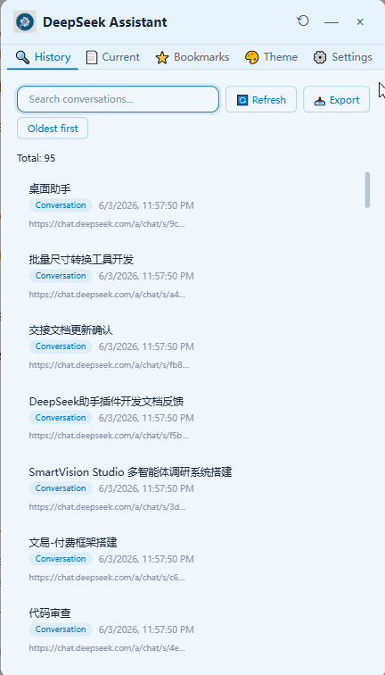
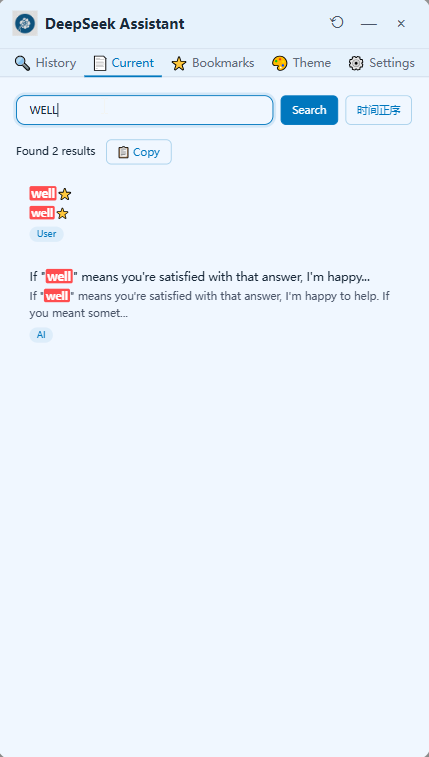
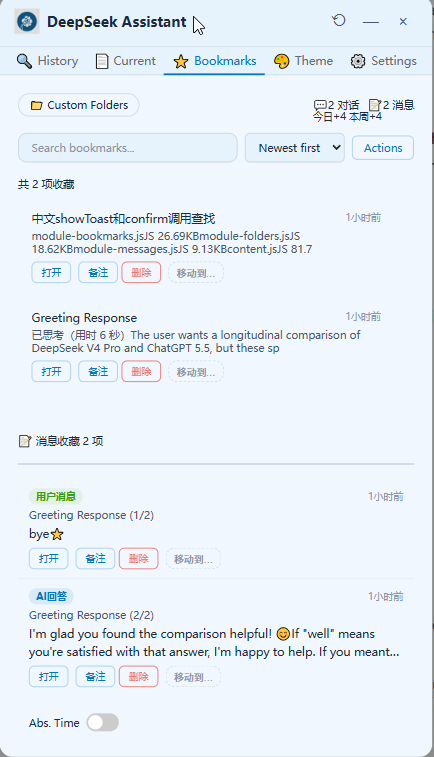
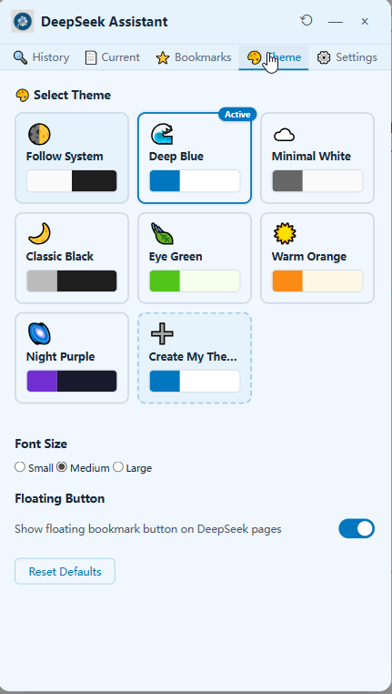
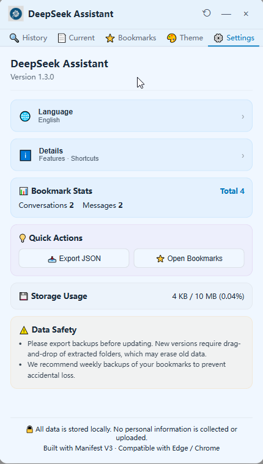

你说得对，GitHub 仓库内的图片引用应使用相对路径。以下是修正后的 SHOWCASE.md：

---

# SHOWCASE

## 功能展示

### 历史搜索

**历史对话搜索**标签页。输入关键词即可检索 DeepSeek 侧边栏中的全部对话记录，支持时间排序。工具栏提供刷新按钮（重新抓取侧边栏）和 CSV 导出按钮，方便将搜索结果保存为电子表格。

---

### 当前对话搜索

**当前对话搜索**标签页。在当前打开的对话页面内搜索关键词，结果列表展示每条匹配消息的标题、类型（AI/用户）、上下文片段。点击任意结果可滚动定位到对应消息并高亮闪烁。支持一键复制全部搜索结果为纯文本或 Markdown 格式。

---

### 收藏夹

**收藏夹**标签页。展示全部收藏的对话和消息，支持按文件夹筛选、搜索过滤。每张卡片显示标题、摘要、备注和时间戳，底部提供打开链接、编辑备注、移动到文件夹、删除四个操作按钮。顶部统计条实时显示对话收藏和消息收藏数量。

---

### 主题切换

**主题设置**标签页。提供深海蓝、经典黑、护眼绿、暖光橙、淡雅灰、极简白共 6 套预设主题，点击即可即时预览。支持自定义取色器调整主题色、背景色和文字色，以及跟随系统深色/浅色模式自动切换。可独立调整面板字体大小。

---

### 设置

**设置**标签页。集中管理语言切换（中文/英文）、悬浮按钮开关、存储用量监控（精确百分比，超 80% 警告）。收藏统计卡片实时显示总计、对话、消息数量，并动态展示当前选中的文件夹名称。底部提供恢复默认设置按钮。
